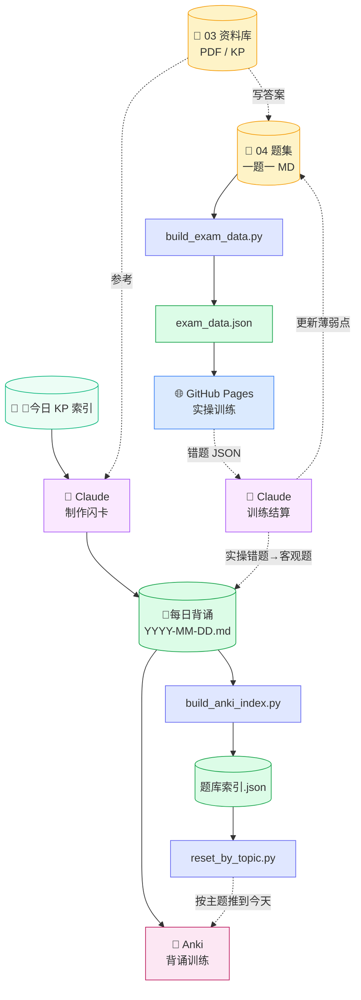

# 主网自动化竞赛 · 训练系统

> 一个为浙江主网自动化竞赛设计的网页刷题系统。  
> 基于 Obsidian vault 题集 + Python 脚本 + GitHub Pages。

🌐 **训练入口**：https://aerfagogogo.github.io/zhuwang-type-drill/

---

## 🌊 工作流

两条并行轨道，实操错题会变成背诵卡进 Anki。

```mermaid
flowchart LR
    subgraph 实操["🛠️ 实操轨"]
        direction LR
        A1([📝 录题]) --> A2([🔄 刷新题库]) --> A3([💻 网页训练]) --> A4([❌ 错题→薄弱点]) --> A5([🎯 惩罚/特训])
        A5 --> A3
    end

    subgraph 背诵["🎴 背诵轨"]
        direction LR
        B1([📚 课后 KP]) --> B2([✍️ 制作客观题]) --> B3([📦 每日背诵.md]) --> B4([🎴 推 Anki]) --> B5([🌙 每日复习])
    end

    实操 -.错题→客观题.-> 背诵

    style A1 fill:#fff7ed,stroke:#fb923c,stroke-width:2px
    style A2 fill:#fef3c7,stroke:#f59e0b,stroke-width:2px
    style A3 fill:#dbeafe,stroke:#3b82f6,stroke-width:2px
    style A4 fill:#fee2e2,stroke:#ef4444,stroke-width:2px
    style A5 fill:#ede9fe,stroke:#8b5cf6,stroke-width:2px
    style B1 fill:#ecfdf5,stroke:#10b981,stroke-width:2px
    style B2 fill:#f0fdf4,stroke:#22c55e,stroke-width:2px
    style B3 fill:#dcfce7,stroke:#16a34a,stroke-width:2px
    style B4 fill:#fae8ff,stroke:#a855f7,stroke-width:2px
    style B5 fill:#fce7f3,stroke:#be185d,stroke-width:2px
```



---

## 🏗️ 数据流



- **实操轨**：`04 题集` → `exam_data.json` → 网页 → 错题回 vault 更新薄弱点
- **背诵轨**：今日 KP → Claude 出客观题 → `每日背诵.md` → Anki
- **交叉点**：网页训练错题 → Claude 抽 KP 做客观题 → 进当天背诵文件 → 推 Anki
- **Anki 桥接**：`AnkiConnect` 插件 + `reset_by_topic.py` 把老题按主题推到今天到期

---

## 🎯 口令字典（你说 → 我做）

**实操轨**

| 你说 | 我做 |
|---|---|
| **「刷新题库」** | 跑 `bash refresh_exam.sh`（build + commit + push） |
| **「为 <学科> 批量生成答案」** | 读资料库 → 给每题写草稿答案 |
| **「修 <学科>-NNN 答案：<问题>」** | 改 MD → 刷新题库 → 推 |
| 粘训练 JSON / **「训练结算」** | 找 `flagged` 修答案；找 `wrong/dontknow` 更薄弱点 + 出惩罚 URL |
| **「出 <学科> 惩罚清单」** | `punishment.py gen <学科> 3` |
| **「惩罚检查 <学科>」** | `punishment.py check <学科>` |

**背诵轨**

| 你说 | 我做 |
|---|---|
| **「整理今日知识点」** | 读今日 KP + 资料库 → 出客观题写进当天背诵 MD |
| **「推 Anki <主题>」** | `reset_by_topic.py <主题>` 把相关老题推到今天 |
| **「重建 Anki 索引」** | `build_anki_index.py`（新建牌组后跑） |
| **「把实操错题做成背诵卡」** | 抽训练 JSON 错题 KP → 出客观题 → 进当天背诵 → 推 Anki |

---

## 📦 入库

题集放在 `04实操题集/<学科>/`，**一题一文件**：

```
04实操题集/
├── 操作系统/      57 题
├── 系统平台/      76 题
├── 数据库/        34 题
├── 基础平台/      54 题
├── 网络分析/      14 题
├── 稳态监控/      28 题
├── 综合智能告警/   7 题
└── 调度数据网/     2 题
```

**frontmatter 模板**：
```yaml
---
id: <学科>-NNN
学科: <学科>
题源: <来源 第X题>
关联KP: "[[KP1]], [[KP2]]"
tags: [命令名, 业务词]
---
```

**正文骨架**：`## 题面` → `## 答案`。仅此两段。

各学科答案格式细则见 vault 顶层 README。

---

## 🚀 训练

| 入口 | 用途 |
|---|---|
| **训练中心** https://aerfagogogo.github.io/zhuwang-type-drill/ | 主页 · 学科卡片仪表盘 |
| **试卷训练** `.../exam.html` | 答题 + API 批卷 + 内嵌盲敲 |
| **速记本** `.../notes.html` | 零碎知识点（不绑题） |

**批卷**：用 AIHUBMIX gpt-4o-mini，每题 ≈ ¥0.001。  
**首次设置**：在「🔧 高级设置」里填 API Key，本地存 localStorage。

**试卷标记按钮**：

| 按钮 | 含义 |
|---|---|
| ← 上一题 / ⏭ 跳过 | 导航 |
| ❌ 不会 | 进薄弱点 |
| ⚠️ 答案有误 | 标记反馈 |
| 提交批卷 | API 评分 |

`correct_streak >= 3` 视为过关。

---

## 🛠️ 脚本一览

```
99-工作流/
├── refresh_exam.sh             一键：build + commit + push
├── build_exam_data.py          MD 题集 → exam_data.json （实操轨）
├── build_index.py              资料库索引（PDF/DOC 全文抽取）
├── punishment.py               盲敲惩罚清单生成/检查
├── gen_drill_url.py            生成盲敲 URL
├── fix_tags.py                 修复 tag 格式
└── anki工具/
    ├── build_anki_index.py     扫所有牌组 → 题库索引.json
    └── reset_by_topic.py       按主题推到今天到期（保留学习历史）
```

---

## 📌 版本

| Tag | 日期 | 内容 |
|---|---|---|
| v1.0 | 2026-05-15 | **当前** · UI 改造：Vibe Island 风格学科卡片仪表盘 |
| v0.6 | 5/14 | 速记本 + 训练页导出 |
| v0.5 | 5/14 | 一站式（API 批卷 + 内嵌盲敲） |
| v0.3 | 5/13 | 试卷训练 v1 |
| v0.1 | 5/13 | 打字训练初版 |

**回滚**：
```bash
cd web && git checkout v0.6 && git push -f origin main
```

**项目地址**：https://github.com/aerfagogogo/zhuwang-type-drill
